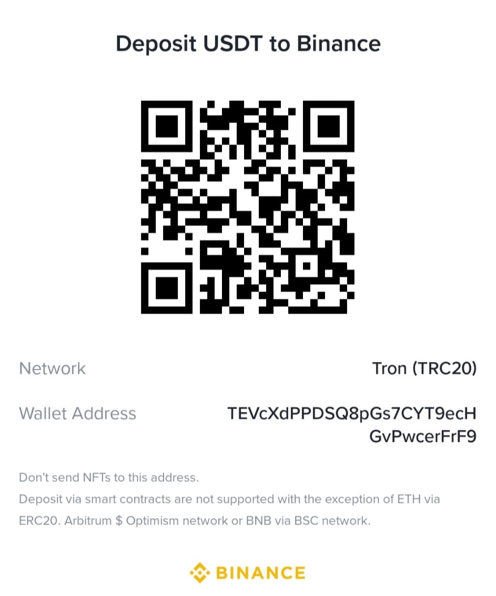

## ⚠️ Disclaimer

This project is for **educational and informational purposes only**.
It does **not constitute financial advice, investment advice, trading advice**, or any other kind of advice.
Use this tool **at your own risk**. The author is **not responsible for any financial losses** or decisions made based on the output of this software.
Always **do your own research** and consult with a professional financial advisor before making any investment decisions.

---

# Binance Pump & Dump Detector

Detect **abnormal price movements** (pumps or dumps) of altcoin/USDT pairs on Binance **Spot** and **Futures** markets by comparing them with **BTC/USDT** using Bayesian Online Changepoint Detection (BOCD).

## 📌 Key Features

* Detects abnormal market behavior in real-time
* Based on [BOCD](https://arxiv.org/abs/0710.3742) with a simple linear regression model
* Supports both **Binance Spot** and **Futures**
* Fully customizable via command-line arguments

---

## 📂 Scripts

| File                                    | Description                          |
| --------------------------------------- | ------------------------------------ |
| `binance_spot_pump_dump_detector.py`    | Detection for Binance Spot market    |
| `binance_futures_pump_dump_detector.py` | Detection for Binance Futures market |

---

## 📦 Installation

1. Clone the repository:

   ```bash
   git clone https://github.com/yourusername/binance-pump-dump-detector.git
   cd binance-pump-dump-detector
   ```

2. (Optional) Create and activate a virtual environment:

   ```bash
   python -m venv venv
   source venv/bin/activate  # On Windows: venv\Scripts\activate
   ```

3. Install dependencies:

   ```bash
   pip install -r requirements.txt
   ```

---

## ⚙️ Usage

Run via command line:

```bash
python binance_spot_pump_dump_detector.py [OPTIONS]
```

### Available Arguments

| Argument                                               | Description                                                                | Default |
| ------------------------------------------------------ | -------------------------------------------------------------------------- | ------- |
| `-z`, `--hazard`                                       | Average number of candlesticks between pumps/dumps. Must be ≥ 5.           | `20`    |
| `-i`, `--kline_interval`                               | Candlestick interval: `m` (minutes), `h` (hours), `d` (days), `w` (weeks). | `5m`    |
| `-t`, `--check_interval`                               | Interval for pump/dump check. Must be ≤ `--kline_interval`.                | `1m`    |
| `-a`, `--initial_window`                               | Initial number of candlesticks to estimate model. Must be ≥ 5.             | `20`    |
| `-w`, `--moving_window`                                | Size of sliding window (≥ 2× `--initial_window`).                          | `300`   |
| `-c`, `--changepoint_threshold_probability`            | Minimum BOCD probability to trigger detection. Between `0.5`–`0.9`.        | `0.5`   |
| `-p`, `--changepoint_other_path_threshold_probability` | Maximum probability for non-pump/dump paths. Between `1e-6`–`0.1`.         | `0.01`  |

---

## 📖 BOCD Resources

* [Original BOCD paper](https://arxiv.org/abs/0710.3742)
* [Gregory Gundersen’s blog post](https://gregorygundersen.com/blog/2019/08/13/bocd/)
* [TechSessions presentation slides](https://speakerdeck.com/techsessions/bayesian-online-change-point-detection-at-scale)

---

## 💡 Example

```bash
python binance_futures_pump_dump_detector.py -i 5m -t 1m -z 30 -a 20 -w 300 -c 0.7 -p 0.01
```

---

## 🧠 Notes

* The algorithm assumes **BTC/USDT** as the market baseline for detecting deviations in altcoin behavior.
* Adjust `--changepoint_threshold_probability` and `--hazard` for more or less sensitivity.

## 🤝 Contact

For **collaboration**, **custom implementations**, or **hiring inquiries**, feel free to reach out via Telegram:

👉 [@RaibekT](https://t.me/RaibekT)

## 🙏 Support This Project

If you find this tool helpful and would like to support further development:

**USDT (TRC20) Donation Address:**

TEVcXdPPDSQ8pGs7CYT9ecHGvPwcerFrF9




> ⚠️ _TRC20 network only. Do not send NFTs or assets from unsupported networks._
